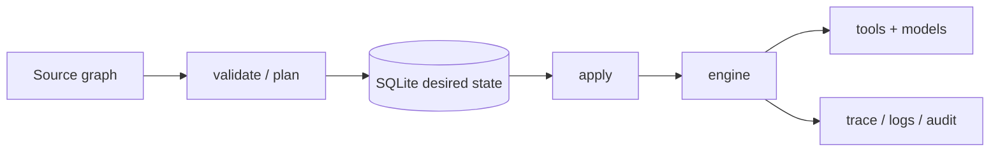

# Terfyn

[](https://github.com/Terfyn/terfyn/actions/workflows/ci.yml)
[](https://github.com/Terfyn/terfyn/actions/workflows/release.yml)
[](https://go.dev/dl/)
[](LICENSE)
[](https://pkg.go.dev/github.com/Terfyn/terfyn)

**Terfyn runs LLM agents behind a capability boundary you can review as a diff — before they run.**

You declare each agent, its tools, its budget, and its approval gates as versioned resources.
`terfyn plan` shows exactly what an agent would be *allowed to do* — like `terraform plan`, but for
the authority of an autonomous agent. Then `terfyn apply` deploys it, `terfyn run` executes the
workflow locally (pausing for human approval where policy requires), and every run leaves a
tamper-evident trace.

The model may behave nondeterministically — but *what it can do* is statically bounded, reviewable
before deployment, and enforced at run time. **The capability grant is the boundary, not the prompt.**

## Quickstart

No API keys needed — `init` scaffolds a mock model and a local `echo` tool, so this runs fully offline.

```bash
# install the CLI (Go 1.22+) — puts `terfyn` on your PATH via $GOBIN / $GOPATH/bin
go install github.com/Terfyn/terfyn/cmd/terfyn@latest
# (no Go toolchain? grab a release binary instead — see Install and project setup below)

terfyn init my-agent-system                       # scaffold a .agent-only project (main.agent)
terfyn validate --project my-agent-system         # types, schemas, references, policy lint
terfyn plan     --project my-agent-system         # what changes + what authority agents gain
terfyn apply    --project my-agent-system --auto-approve
terfyn run      workflow/hello --project my-agent-system
terfyn logs     --project my-agent-system --workflow hello   # the trace it recorded
```

## A one-minute example

An agent is a prompt **plus a capability grant**. This reviewer may read files and run tests — but
it holds no write grant, so it **cannot** write, no matter what its prompt says:

```agent
agent reviewer {
    model openai/gpt-5
    instructions "Review the pull request. You may read files and run tests."
    grants {
        tool.workspace.read_file
        tool.workspace.run_tests
    }
}
```

Now suppose someone adds `tool.workspace.write_file` to that block. `terfyn plan` doesn't just show a
changed line — it flags that the agent's **autonomous authority widened**, as a high-severity item a
human reviews *before* `apply`:

```text
Capability delta:
Agent/reviewer
+ tool.workspace.write_file

Authority:
  autonomous  -> WIDENED

Risk delta:
high:
- [high] authority_widening: AUTONOMOUS authority WIDENED.
```

At run time the boundary is enforced, not advisory: a `reviewer` that tries to call `write_file`
anyway is **denied by capability** — the prompt was never the control.

▶ **Run this end to end:** [`examples/implement-review-loop`](examples/implement-review-loop/README.md)
— an Implementer and an independent Reviewer loop over a coding task (bounded to 3 rounds), with the
exact write-boundary and plan authority-diff above, fully offline with the mock model.

## Architecture

Source graph → `validate` / `plan` → SQLite desired state → `apply` → engine → tools + models → trace / logs / audit.



Expanded diagram, plan-time bounds, and closed-world caveats: [`docs/architecture.md`](docs/architecture.md). Product spec: [`docs/DESIGN_DOC.md`](docs/DESIGN_DOC.md).

## The differentiator: plan-time bounds on authority

This is not another orchestrator (Temporal, Dagger, LangGraph). Those schedule work. Terfyn's direction is a **plan-time effect bound** — a sound static upper bound on what an autonomous agent can do, reviewable as a diff ([#189](https://github.com/Terfyn/terfyn/issues/189) / [#191](https://github.com/Terfyn/terfyn/issues/191)). `terfyn plan` prints that bound and the authority delta vs stored deployment state.

**Today** `terfyn plan` diffs **capabilities (grants)**, **approvals**, **models**, **budgets**, **C1 risk items**, and **effect/capability/authority** against SQLite desired state:

```text
Plan: 0 to add, 3 to change, 0 to delete
~ update Agent/reviewer
    spec.model: "mock/gpt-4" -> "mock/gpt-4o"
    spec.tools.1:  -> "tool.github.default"
~ update Policy/default
    spec.approvals.requiredFor.0: "tool.helper.echo" -> "tool.github.issues.write"
    spec.execution.maxTotalCostUsd: 3 -> 10
~ update Tool/github
    spec.safety.sideEffects: false -> true

Risk delta:
high:
- [high] approval_removal: Approval requirements removed for "tool.helper.echo" (Policy/default).
- [high] budget_relaxation: Cost ceiling increased (Policy/default).
- [high] tool_surface_change: Agent tools list gained write-capable tool "tool.github.default" (Agent/reviewer; declares side effects).
medium:
- [medium] model_change: Agent model changed (Agent/reviewer).
```

When the graph declares tool operations, `plan` also prints the effect bound and an **authority delta** (`bound(desired)` vs `bound(deployed)`). Capability changes and effect changes are separate lines; `AUTONOMOUS` `WIDENED` means a nondeterministic agent's action space grew — including when a new grant does not add named effects.

```text
Effect bound (Workflow/pr-review):
high:
- [high] effect_bound: github.write       autonomous  Agent/reviewer may select tool.github.post_comment
medium:
- [medium] effect_bound: github.read        static      step fetch_pr

Capability delta:
Agent/reviewer
+ tool.github.post_comment

Authority:
  static      -> unchanged
  autonomous  -> WIDENED
```

Agents and workflows are authored in [`.agent`](docs/LANGUAGE.md), the surface syntax fixed by [ADR 002](docs/adr/002-language-frontend-and-ir-expressiveness.md); the loader compiles `.agent` (type/effect checking + argument rebind) into the resource graph. Workflows run end-to-end, **including conditionals, loops, and dynamic fan-out** ([#199](https://github.com/Terfyn/terfyn/issues/199)/[#259](https://github.com/Terfyn/terfyn/issues/259)): a control-flow workflow lowers to the execution IR, is pinned into the deployment snapshot, and runs on the `execir` interpreter (see `examples/agent-control-flow`). `.agent` is the **sole executable source** ([ADR 007](docs/adr/007-remove-yaml-ingestion.md)): a `project.yaml` handed to `validate`/`plan`/`apply`/`run` is refused with a `terfyn migrate --to-agent` hint. Machine producers build the graph through the **typed ResourceGraph ingress**, not a second source language. YAML is a **one-way output** — `terfyn export --format yaml` materializes the compiled graph for inspection or handoff, not for re-execution. Lead on **capability**, not format.

## Examples

All run offline with the mock model (no API keys) unless noted.

- **[`examples/implement-review-loop`](examples/implement-review-loop/README.md)** — *deterministic bounded control around nondeterministic agents.* An Implementer and an independent Reviewer pass a structured `CodingState` through a bounded `while … limit 3`; the Reviewer holds `read_file` + `run_tests` but **not** `write_file`, so a write attempt is denied by capability, and `terfyn plan` flags granting it write as `AUTONOMOUS authority WIDENED` (the one-minute example above, made runnable).
- **[`examples/incident-triage`](examples/incident-triage)** — an agent that can page, read logs, and file a ticket, but **cannot restart a service** unless policy `approvals.requiredFor` includes `tool.restart.restart` and it is **pre-approved** with `--approve tool.restart.restart`. Unapproved, `terfyn run` fail-closes with **exit 5**; with `--approve` it completes and `audit verify` passes.
- **[`examples/hitl-resume`](examples/hitl-resume/README.md)** — a run that **pauses** at a gated tool (status `interrupted`, exit 0) and resumes with `--resume <id> --decision approve`.
- **[`examples/audit-tamper`](examples/audit-tamper/README.md)** — a tamper-evident trace: `audit verify` passes on a clean run, then **fails (exit 1)** after a planted row edit.

Other walkthroughs: policy-blocked PR review in [`examples/pr-review-demo`](examples/pr-review-demo/README.md) (no API keys); live GitHub read/write with a **mock** reviewer in [`examples/pr-review-github`](examples/pr-review-github/README.md); the same flow with OpenAI `gpt-4o-mini` plus GitHub Actions in [`examples/pr-review-github-actions`](examples/pr-review-github-actions/README.md) ([PR workflow](.github/workflows/terfyn-pr-review.yml); optional manual [`owner`/`repo`/`number`](.github/workflows/terfyn-pr-review-publish.yml)).

---

## Why this exists

Most agent stacks bury prompts, tool wiring, and permissions in application code. That makes it hard to answer: *Is this config valid? What authority changed? What are we about to grant? What actually ran? Did policy allow it?*

**Terfyn** is a small Go CLI (`terfyn`) plus a resource graph so teams can:

- Review **capability diffs** (`plan`) before changes land
- Track **deployment state** separately from **runtime traces**
- Enforce **policies** (budgets, approvals, tool rules) at execution time
- Stay **local-first** while the architecture leaves room for a future remote control plane

---

## Mental model

| Idea | Analogy |
|------|---------|
| Desired resources in Git | **GitOps** |
| `plan` / `apply` / drift | **Terraform** |
| Typed resources (`Project`, `Workflow`, `Policy`, …) | **Kubernetes**-style API |
| Tool and IO contracts | **OpenAPI**-style explicitness |

---

## Compared with adjacent tools

Terfyn is the **declarative governance/config layer** for agent systems — not a replacement for durable-execution engines or code-first agent runtimes.

| Capability | This project | OpenAI Agents SDK | LangGraph | Temporal | Terraform |
|---|---|---|---|---|---|
| Role | Governance/config: versioned resources, plan/apply, policy | Code-first agent runtime | Code-first graph orchestration | Durable workflow execution | Infrastructure as code |
| Durable execution / distributed scheduling | No | No | Optional checkpointers; not a durable-execution engine | Yes | N/A |
| Code-first agent runtime | No (resource graph; `.agent` authoring, typed API for machines, one-way YAML export) | Yes | Yes | Workflow SDK, not an agent runtime | No |
| Desired-state plan / apply | Yes (`terfyn plan` / `apply` vs SQLite) | No | No | No | Yes |
| Plan-time effect bound | **Shipped** ([#189](https://github.com/Terfyn/terfyn/issues/189) / [#190](https://github.com/Terfyn/terfyn/issues/190) / [#191](https://github.com/Terfyn/terfyn/issues/191)): bound over the **callable operation set**, including autonomous tool selection; `terfyn plan` prints the bound and authority delta. No listed comparable. | No | No | No | No |

The bound is not over what those operations do at the far end; the trust anchor is human review of the tool manifest. Manifest pin ([#204](https://github.com/Terfyn/terfyn/issues/204)) is **enforced** at dispatch: an operation outside a tool's deployed capability manifest is denied on the policy path, so a live MCP `tools/list` can no longer expand the callable world (discovery merges only `spec.safety`, never the operation set). A resumed run enforces the manifest it started with — hydrated from its deployment snapshot ([#207](https://github.com/Terfyn/terfyn/issues/207)) — so a widening apply between suspend and resume does not widen the resumed run's authority. `terfyn plan` diffs capabilities (grants), approvals, models, budgets, C1 risk items, and effect/capability/authority.

---

## Features (MVP today)

- **`terfyn init`** — scaffold a `.agent`-only project (a single `main.agent` with a starter agent, policy, and workflow; no `project.yaml`)  
- **`terfyn export --format yaml`** — materialize the compiled resource graph as YAML on demand (nothing written to disk by default; the stdout YAML is **one-way output, not an executable source** under [ADR 007](docs/adr/007-remove-yaml-ingestion.md)). `--output DIR` instead writes a **loadable** `.agent` project directory — `validate`/`plan`/`apply`/`run --project DIR` works ([#507](https://github.com/Terfyn/terfyn/issues/507))  
- **`terfyn migrate --to-agent`** — convert a project's YAML-authored resources (providers/tools/policies/environments/agents **and workflows** — steps, interpolated args, approvals, object outputs) to `.agent` source (stdout, or `--output FILE`); non-destructive, and reports only the constructs with no `.agent` form (a step-DAG that cannot linearize, a non-convention schema ref) rather than emitting lossy output  
- **`terfyn fmt`** — format `.agent` sources to canonical form (works on an `.agent`-only project; also normalizes any YAML still in the project closure)  
- **`terfyn validate`** — load project, apply **project defaults** (`spec.defaults`), then **environment overlays** (`-e` / `--env`, `Environment` resources §7.6), then validate graph, schemas, and references; runs **policy lint** (ungated sensitive tools, invalid HITL config, etc.) as **advisory** output — use **`--strict`** to exit **2** on high-severity lint findings (fail-closed safety metadata still gates at **run** even when lint passes)  
- **`terfyn plan`** — diff desired graph vs SQLite **deployment** state; risk hints including policy lint, effect bound, and authority delta; JSON/YAML output includes **`policyLint`**, **`deploymentBaseline`**, **`effectBound`**, and **`authority`**
- **`terfyn apply`** — persist plan (TTY confirm or `--auto-approve` / `TERFYN_AUTO_APPROVE`); **optimistic concurrency** — if the deployment store changed after the plan snapshot (e.g. another process applied the same `--state` file while this run waited at the prompt), apply fails with **exit code 3**; re-run **plan** then **apply**  
- **`terfyn run`** — execute a workflow locally; JSON Schema for inputs where configured; policy gates pause for **human-in-the-loop (HITL)** approval when a tool call requires it  
- **`terfyn logs`** — read **trace events** from SQLite (`--run`, `--workflow`, or recent runs)
- **`terfyn audit verify`** — re-walk hash-linked trace chains and detect tampering (see [`docs/AUDIT_CHAIN.md`](docs/AUDIT_CHAIN.md))  
- **Tools** — **`native`**, **`http`**, **`mock`**, and **`mcp`** — MCP supports **stdio** (subprocess) or **streamable HTTP** (`spec.mcp.transport: http`, `url`, optional `headers` with `env:` tokens)  
- **Project defaults** — besides **`model`** and **`policy`**, optional **`runtime`** flows to **`spec.runtime`** on workflows (and the project) when omitted (MVP: **`local`** or an external target such as `claude-code`/`gemini`; per-agent `runtime` is no longer a field, see spec validation)  
- **Output** — table, JSON, or YAML (`-o` / `--output`)  
- **State** — single SQLite file (default `.agentic/state.db` under the project root; override with `--state`)  
- **Tests** — unit/integration coverage, golden CLI output tests, end-to-end `init → … → logs` in `test/integration`  

See **section 18 (MVP)** and **section 19 (End Goal)** in [`docs/DESIGN_DOC.md`](docs/DESIGN_DOC.md) for the full included/excluded list.

---

## Install and project setup

The [Quickstart](#quickstart) above is the fast path; this section covers install options and how a
project is authored.

### Install

**Recommended — `go install`** ([Go 1.22+](https://go.dev/dl/)) puts `terfyn` on your `PATH` (in `$GOBIN`, or `$GOPATH/bin` — ensure that directory is on `PATH`):

```bash
go install github.com/Terfyn/terfyn/cmd/terfyn@latest
```

**No Go toolchain?** Download a [release binary](#prebuilt-binaries) and put `terfyn` (or `terfyn.exe`) on your `PATH`.

**From a clone** (for development): `make build` writes `bin/terfyn`; `make install` runs `go install ./cmd/terfyn` (`-trimpath`).

```bash
git clone https://github.com/Terfyn/terfyn.git
cd terfyn
make build   # writes bin/terfyn
```

### Prebuilt binaries

[GitHub Releases](https://github.com/Terfyn/terfyn/releases) ship **`terfyn`** for common platforms (`.tar.gz` on Linux/macOS, `.zip` on Windows) plus **`SHA256SUMS.txt`**. Pick the archive that matches your machine, for example:

| Platform | Asset suffix |
|----------|----------------|
| Linux x86_64 | `linux-amd64.tar.gz` |
| Linux arm64 | `linux-arm64.tar.gz` |
| macOS Intel | `darwin-amd64.tar.gz` |
| macOS Apple Silicon | `darwin-arm64.tar.gz` |
| Windows x86_64 | `windows-amd64.zip` (contains `terfyn.exe`) |

`terfyn version` reports the release tag (e.g. `v0.1.4`).

Releases are **created automatically** when changes land on **`main`**, using a **patch** semver bump over the latest `vMAJOR.MINOR.PATCH` tag (merges that only touch Markdown or the root `Makefile` do not trigger a release). To cut **minor** or **major** bumps on demand, run the [**Release** workflow](https://github.com/Terfyn/terfyn/actions/workflows/release.yml) manually (**Actions → Release → Run workflow**) and choose the bump type.

### Create a project and run the loop

From the repo root (or anywhere):

```bash
terfyn init my-agent-system
terfyn validate --project my-agent-system
terfyn plan   --project my-agent-system
terfyn apply  --project my-agent-system --auto-approve
terfyn run    workflow/hello --project my-agent-system
terfyn logs   --project my-agent-system --workflow hello
terfyn audit verify --project my-agent-system --run <run-id>
terfyn inspect --web --project my-agent-system   # read-only local UI on http://127.0.0.1:8787
```

`inspect --web` binds to **localhost only** and opens the state DB read-only. Avoid running it while `terfyn run` is writing the same SQLite file (you may see `database is locked` without WAL); use it when runs are idle or on a copy of the DB.

### Authoring: `.agent` source

A Terfyn project is authored **entirely in `.agent`** ([grammar reference](docs/LANGUAGE.md)) — agents, workflows, tools, and policies all live in `.agent` files. There is **no `project.yaml`**: `.agent` files anywhere under the project root are discovered and compiled automatically, the project name is the directory name, and built-in model providers (`anthropic/*`, `openai/*`, `gemini/*`, `grok/*`, `kimi/*`, `mock/*`) resolve with no configuration — their credentials come from the environment at run time. After **`terfyn init my-agent-system`**, `my-agent-system/main.agent` is:

```text
agent assistant {
    model mock/default
    instructions """
    You are a helpful assistant.
    """
}

// The default project policy. shell_safe is the conservative starting point:
// safe reads run freely while shell commands and side-effecting tools require approval.
policy default {
    preset shell_safe
}

workflow hello(input: string) -> string
    policy default
{
    return assistant(input)
}
```

That is the whole project — no other files are needed. Add tools, agents, and policies as more `.agent` declarations (or scaffold them with **`terfyn new`**); switch models by naming a built-in provider (`model openai/gpt-4o-mini`), and only declare a `provider` alias for a custom endpoint or credential. Environment overlays, MCP/HTTP tools, and HITL gates are all `.agent` constructs — see [`docs/LANGUAGE.md`](docs/LANGUAGE.md).

YAML is **not** a project source at all: `terfyn init` / `terfyn new` never write it, nothing you author needs it, and under [ADR 007](docs/adr/007-remove-yaml-ingestion.md) `.agent` is the **only executable source**. A `project.yaml` handed to `validate`/`plan`/`apply`/`run` is **refused** with a `terfyn migrate --to-agent` hint — there is no graph-construction path from a YAML project manifest any more. YAML survives only as a **one-way output**: `terfyn export --format yaml` materializes the compiled graph to stdout for inspection or handoff, not for re-execution. (`terfyn export --output DIR` writes a *loadable* project — but as `.agent`, the only executable source, not YAML — so `validate`/`plan`/`apply`/`run --project DIR` works.) Machine producers construct the graph through the **typed ResourceGraph ingress** (the same normalization/validation/effect pipeline as `.agent`), not through a second source language. To convert a legacy YAML project to `.agent`, run **`terfyn migrate --to-agent`**.

Field-by-field rules, extra kinds, env overlays, MCP HTTP tools, and **`defaults.runtime`** are in [`docs/DESIGN_DOC.md`](docs/DESIGN_DOC.md). See [`docs/EXAMPLES.md`](docs/EXAMPLES.md) for Anthropic fragments, MCP over HTTP, and structured-output notes.

Notes:

- **`init`** creates `my-agent-system/` with `apiVersion: agentic.dev/v0` resources and a **`hello`** workflow (native `echo` tool only — **no network**).  
- **`apply`** in non-interactive environments needs **`--auto-approve`** or **`TERFYN_AUTO_APPROVE=1`**.  
- **`run`** HITL: gated tool calls exit with **`Status: interrupted`** (exit **0**). Resume with **`--resume <run-id> --decision approve|reject|edit|switch`** (use **`--decision-edit-json`** / **`--decision-switch-target`** when needed), or skip prompts with **`--auto-approve`** / **`TERFYN_AUTO_APPROVE=1`**. Pre-approve a specific call with repeated **`--approve <uses>`**. Set **`TERFYN_HITL_ACTOR`** to attribute decisions in trace logs.  
- **`Policy.spec.hitl.interruptOn`** keys are **Tool metadata.name** values; they configure review options (edit rules, switch targets) for calls already gated by **`approvals.requiredFor`** or safety metadata — they do not gate tools on their own.  
- **`run`** stores traces in the **same** SQLite file used for plan/apply (default **`.agentic/state.db`** under `--project`). Optional OTLP export (`spec.telemetry`, off by default) is additive only — see [`docs/OTEL.md`](docs/OTEL.md). When enabled you need `serviceName` plus either `consoleExport: true` or an `endpoint` (`https://…` or `env:VAR`, e.g. `env:OTEL_EXPORTER_OTLP_ENDPOINT`). Export that variable before `run` if you use `env:`; if it is missing or the collector is unreachable, `terfyn` logs a warning, skips OTLP, and the workflow still completes (SQLite traces unchanged).  
- If **`spec.traces.retentionDays`** is a positive integer, runs older than that many **UTC calendar days** (by `runs.started_at`) are deleted lazily on **`run`** and **`logs`** (child trace rows cascade). Unset or non-positive means no pruning.  
- **Trace payload redaction** (issue #110): before SQLite storage, event JSON is sanitized, key-redacted, and size-capped. Defaults mask common secret key names (substring match on map keys). Optional project knobs:
  - **`spec.traces.redactKeys`** / **`maxPayloadBytes`** — merged with defaults; also available under **`spec.traces.redaction`** together with **`maxDepth`**, **`maxStringChars`**, and **`maxBytes`** (max bytes for **binary** previews in sanitized values, not the overall JSON cap).
  - Stored events may show **`[REDACTED]`**, **`payload_truncated`** / **`preview`**, or depth/binary placeholders in **`logs`** / **`inspect --web`**.
- Use **`logs --run <id>`** after a run if you want a single run’s trace (IDs are printed by **`run`**).  

### Global flags (common)

| Flag | Purpose |
|------|---------|
| `--project <path>` | Project root (default `.`) |
| `--state <path>` | SQLite file override |
| `-e` / `--env` | Environment overlay name |
| `-o` / `--output` | `table`, `json`, or `yaml` |
| `--no-color` | ASCII-friendly validate output |

Exit codes are summarized in **section 11.2** of [`docs/DESIGN_DOC.md`](docs/DESIGN_DOC.md) (`0` success, `2` validation, **`3` plan/apply conflict** when deployment state changed after `plan` or resolved config drifted before `run`, `4` execution, `5` policy denial, …).

### User-local config (per-developer overrides)

Config is resolved in this order (highest wins): **CLI flags** → **environment overlay** (`-e`) → **project config** (the `Project` resource's `spec.defaults`/`state`/`providers`/`traces`/`telemetry`, authored in `.agent`) → **user-local** → **built-in defaults**.

Optional user-local files (git-ignored, strict YAML — typos fail `validate`):

| Path | Scope |
|------|--------|
| `$XDG_CONFIG_HOME/terfyn/config.yaml` or `~/.config/terfyn/config.yaml` | Global per-user defaults (`defaults`, `state`, `providers`, `traces`, `telemetry`) |
| `.agentic/local.yaml` under `--project` | Project-scoped overrides (same fields; wins over the global file) |

`validate`, `plan`, and `apply` write `.agentic/resolved-config.json` (digest of the resolved graph + env + state path). `run` rejects drift from that snapshot with exit **3** — re-run `validate` or `plan` after changing config.

---

## Repository layout (high level)

| Path | Role |
|------|------|
| `cmd/terfyn` | CLI entrypoint |
| `internal/cli` | Cobra commands, flags, golden tests |
| `internal/spec` | Resource types (YAML/JSON codec), normalize, validate |
| `internal/config` | Layered config resolution, immutable snapshot |
| `internal/project` | Load project + imports |
| `internal/lang` | `.agent` frontend: lexer, parser, typed AST, checker, lowering to the resource + execution IR |
| `internal/execir` | Execution IR: where control flow (`if`/`for`/`parallel`) lives; the single interpreted run form (ADR 002 §5) |
| `internal/plan` | Planner and risk summary |
| `internal/apply` | Apply plan to deployment store |
| `internal/engine` | Workflow execution — runs the lowered `execir` program (the sole run path since #278) |
| `internal/policy` | Policy evaluation |
| `internal/state/sqlite` | SQLite deployment + runtime/trace tables |
| `internal/audit` | Tamper-evident hash chain for trace events (issue #116) |
| `test/integration` | End-to-end CLI flow tests |
| `docs/DESIGN_DOC.md` | Spec, CLI UX, architecture, roadmap |
| `docs/GITHUB_ACTIONS.md` | Running **`terfyn`** from GitHub Actions (tokens, exit code **5**, template path) |
| `examples/pr-review-github-actions/` | Full **`gpt-4o-mini`** project; PR workflow **`.github/workflows/terfyn-pr-review.yml`**; optional publish **`.github/workflows/terfyn-pr-review-publish.yml`** |

---

## Development

**`make`** defaults to **`help`**, which lists targets; the table below mirrors the [`Makefile`](Makefile) (`##` comments and recipes).

| Target | What it does |
|--------|----------------|
| `help` | Show usage and target list (default goal) |
| `all` | `fmt` → `vet` → `test` → `build` (handy before a push) |
| `build` | `go build` → `bin/terfyn` |
| `install` | `go install ./cmd/terfyn` (`-trimpath`; uses `GOBIN` / `GOPATH/bin`) |
| `clean` | Remove `bin/` and `coverage.out` |
| `fmt` | `go fmt ./...` |
| `verify-fmt` | Fail if `gofmt -l` would list files (matches CI-style formatting check) |
| `vet` | `go vet ./...` |
| `test` | `go test ./... -race` |
| `test-coverage` | Tests with `-coverprofile=coverage.out` and a one-line `go tool cover -func` summary |
| `check` | `vet` + `test` only (no formatting writes) |
| `ci` | `verify-fmt` + `vet` + `test` (no build) |

CI (`.github/workflows/ci.yml`) runs **Linux, macOS, and Windows** on Go **1.22.x**, plus **Go 1.23.x** on Linux, with **race** and **shuffle** enabled (workflow steps are defined in YAML, not via `make ci`).

### Updating CLI golden files

When table output is intentionally changed:

```bash
GO_UPDATE_GOLDEN=1 go test ./internal/cli/... -run TestGolden_
```

---

## Roadmap

### Recently shipped

- **Execution-IR convergence** ([#255](https://github.com/Terfyn/terfyn/issues/255)): both ingress paths (`.agent` and YAML) compile to one `execir` program, which is the **single run path** — the parallel `WorkflowStep` DAG runtime has been retired ([#278](https://github.com/Terfyn/terfyn/issues/278)).
- **Control flow end-to-end** ([#259](https://github.com/Terfyn/terfyn/issues/259)): `.agent` `if` / `for` / `parallel for` lower to the pinned execution IR and run on the engine (`examples/agent-control-flow`).
- **Parallel branches, subworkflows, and workflow-level approval steps** ([#192](https://github.com/Terfyn/terfyn/issues/192) / [#194](https://github.com/Terfyn/terfyn/issues/194) / [#195](https://github.com/Terfyn/terfyn/issues/195)), durable across checkpoint/resume including concurrent per-branch HITL suspend ([#258](https://github.com/Terfyn/terfyn/issues/258) / [#270](https://github.com/Terfyn/terfyn/issues/270)).
- **`terfyn test`** fixture runner ([#176](https://github.com/Terfyn/terfyn/issues/176); see [`docs/TESTING.md`](docs/TESTING.md) and [`examples/regression-test`](examples/regression-test)).
- **Author real agents in `.agent`** — first-class `instructions` / `description` / `constraints`, bounded state-carrying `while`, argument `${...}` templates, and a flagship implement/review loop ([#285](https://github.com/Terfyn/terfyn/issues/285), epic complete).
- **Manifest pin enforcement** so the effect bound has a closed world ([#204](https://github.com/Terfyn/terfyn/issues/204) / [#207](https://github.com/Terfyn/terfyn/issues/207)): an operation outside a tool's deployed capability manifest is denied at dispatch, so a live MCP `tools/list` can no longer expand the callable set — and a resumed run enforces the manifest it started with, hydrated from its deployment snapshot, rather than whatever is deployed at resume time.

### Near term

- More **`diff` / drift** UX where the design doc calls for it (beyond today’s resource-level diff)  
- Richer **`logs`** filtering (see sections **10.2** and **17.3** in `docs/DESIGN_DOC.md`); **`inspect --web`** covers read-only run/state browsing ([#109](https://github.com/Terfyn/terfyn/issues/109))  

### Post-MVP (from design doc section 19)

- Modules/registry, remote shared state, reconciliation controllers  
- Scheduled and event triggers  
- Stronger drift semantics and multi-runtime targets  
- Multi-tenant controls  

The **recommended implementation phases** are outlined in **section 20** of [`docs/DESIGN_DOC.md`](docs/DESIGN_DOC.md).

---

## Documentation

- **[`docs/DESIGN_DOC.md`](docs/DESIGN_DOC.md)** — design document v0 (problem statement, spec, CLI, engine, state model, testing strategy, MVP vs end state, section 23 recommendation).  
- **[`docs/AGENT_LOOP.md`](docs/AGENT_LOOP.md)** — bounded agent tool-calling loop: grants, advertised uses, `maxIterations`, policy on every inner call, traces, HITL vs exit **5** (issues #160 / #161 / #175).  
- **[`docs/AUDIT_CHAIN.md`](docs/AUDIT_CHAIN.md)** — hash-linked trace audit chain and `terfyn audit verify` (issue #116).  
- **[`docs/ATTRIBUTION.md`](docs/ATTRIBUTION.md)** — tenant, thread, and actor fields on runs and traces (issue #111).  
- **[`docs/OTEL.md`](docs/OTEL.md)** — optional OTLP trace export alongside SQLite (issue #108).  
- **[`docs/TESTING.md`](docs/TESTING.md)** — `terfyn test` fixture format; CI gate walkthrough in [`examples/regression-test`](examples/regression-test).  
- **[`examples/pr-review-demo/README.md`](examples/pr-review-demo/README.md)** — end-to-end demo: structured review output, traceable run, **approval-gated** write (`validate` → `plan` → `apply` → `run` → `logs`).
- **[`examples/regression-test/README.md`](examples/regression-test/README.md)** — `terfyn test` is green on a gated publish and red after dropping `requiredFor` (issue #176).
- **[`docs/EXAMPLES.md`](docs/EXAMPLES.md)** — copy-paste YAML and CLI examples (`init`, mock vs OpenAI, workflows, environment overlays).  
- **[`CODE_OF_CONDUCT.md`](CODE_OF_CONDUCT.md)** — Contributor Covenant 2.1; participation expectations and reporting.  
- **License:** [Apache-2.0](LICENSE)  

---

## Contributing

Issues and pull requests are welcome. See **[`CONTRIBUTING.md`](CONTRIBUTING.md)** for local setup, tests, golden updates, and pull request expectations.
